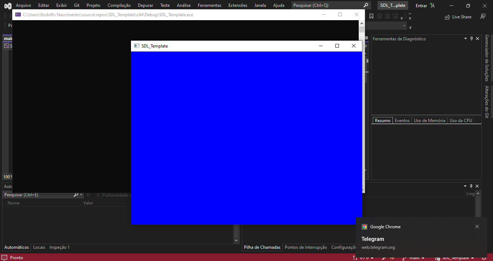
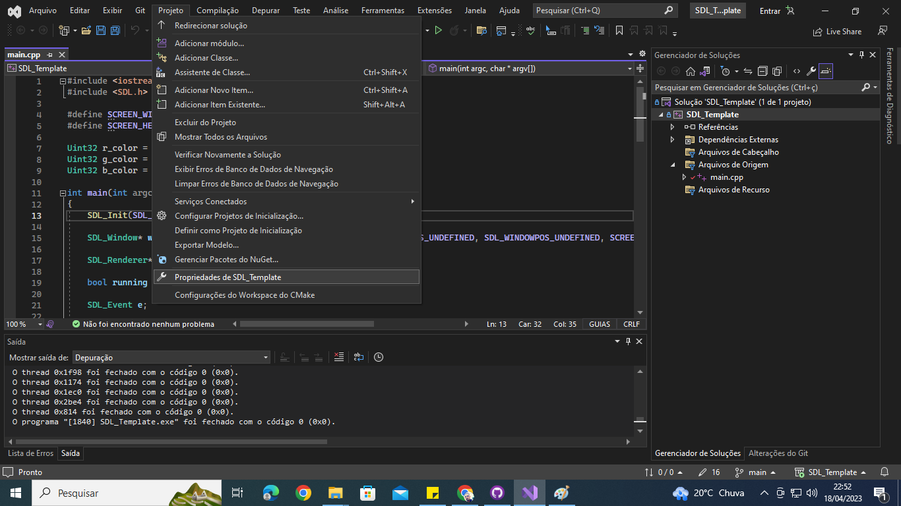
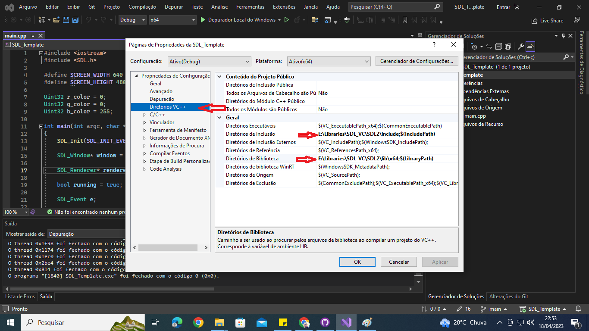
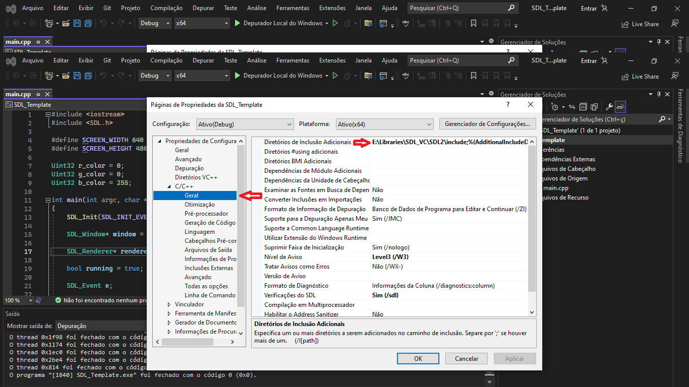
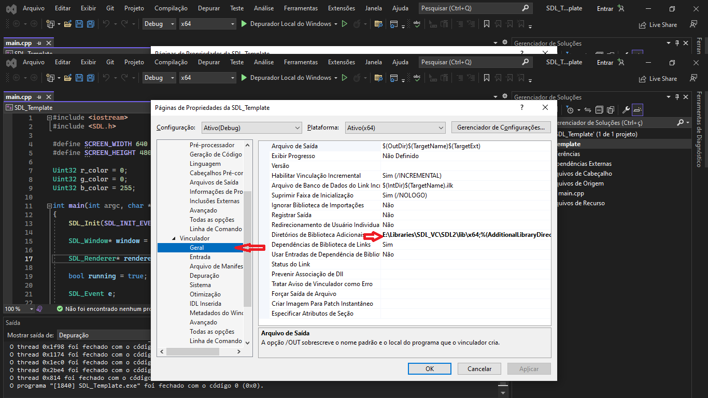
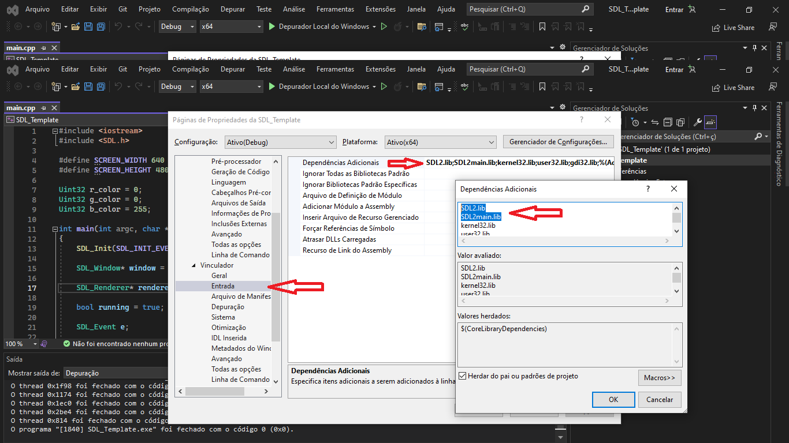

# SDL_Template
A SDL2 template for you to use in your project.

Step to setup sdl2 includes and lib in your visual studio 2022.
Go to the project properties:

Now assume you have the SDL2 in your pc, copy the include and lib path and paste in the VC++ Directories:

Do the same steps in the C++ General Include and Linker General as image follows:

Also, don't forget to put the libs in the input inside Linker, it's gonna be 2 files:

Yeah you did it!
If you have any problem in compile I would like to recommend you to wacth this video tutorial from Pikuma, it help me a lot!
https://www.youtube.com/watch?v=tmGBhM8AEj8&t=199s
